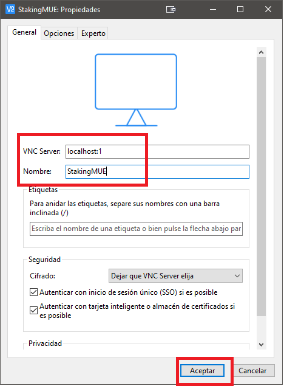

# Configuración VPS para staking

En este manual vamos a detallar los pasos necesarios para crear un servicio VPS basado en **Ubuntu Linux 18.04 LTS** base para poder realizar labores de staking.

Puedes ver en detalle todos los pasos a realizar en este [vídeo](....).

## Selección de servicio VPS y necesidades mínimas

Se ha seleccionado para la instalación el servicio de [Vultr](https://www.vultr.com/?ref=8598591-6G) debido a que nos proporciona 100\$ de saldo al registrarnos para usarlos durante el primer més usando este enlace https://www.vultr.com/?ref=8598591-6G.

Cada servicio de staking tiene unas necesidades mínimas necesarias:

-   **MonetaryUnit**: 1 Core, 1GB RAM y 10GB de disco duro
-   **OkCash**: 1 Core, 2GB RAM y 10GB de disco duro
-   **Energi**: 1 Core, 1GB RAM y 10GB de disco duro

Debido a eso y tomando como servicio VPS [Vultr](https://www.vultr.com/?ref=8598591-6G) deberemos elegir los siguientes tipos de servicios:

-   **MonetaryUnit**: Server Cloud Compute --> Server Size 25 GB SSD (5\$/mes)
-   **OkCash**: Server Cloud Compute --> Server Size 55 GB SSD (10\$/mes)
-   **Energi**: Server Cloud Compute --> Server Size 25 GB SSD (5\$/mes)

Otro punto a tener en cuenta a la hora de crear el servidor será la ubicación. Debido a ciertas restricciones respecto a las criptomonedas, es preferible elegir cualquier ubicación fuera de USA, y siempre es preferible, por rendimiento en la conexión de red, que se encuentre físicamente lo más cerca posible de nuestra ubicación.

## Creación del servidor

Para este proceso vamos a tomar de ejemplo **MonetaryUnit** por ser el más fácil y económico de construir. Los pasos, una vez creada la cuenta en [Vultr](https://www.vultr.com/?ref=8598591-6G) serían los siguientes:

1. Accederemos al apartado de **Products/Instances** y pulsaremos el botón de añadir ubicado a la derecha.
   

2. Elegiremos las siguientes opciones:

    - **Choose Server**: _Cloud Compute_
    - **Server Location**: P.e. _Amsterdam_

    

    - **Server Type**: En la pestaña de _64 bits OS_ elegiremos _Ubuntu 18.04 LTS_ por ser el más compatible con todos los tipos de staking que vamos a usar.
    - **Server Size**: _25 GB SSD_ cuyo coste será de 5\$/mes y tiene como características adicionales _1 CPU, 1024MB Memory y 1000GB Bandwidth_

    

    - **Establecer nombre al servidor**: P.e. _StakingMUE_
    - **Deploy Now**: Pulsaremos el botón para crear la instancia del servidor VPS.

    

Una vez realizadas estas acciones nos devolverá a la pantalla de _Products_ donde podremos ver como se instala el servidor VPS que hemos seleccionado. Una vez terminada la instalación nos aparecerá como _Running_. Si pulsamos sobre los tres puntos a su derecha podremos acceder a los detalles del servidor.


En este apartado tendremos datos muy importantes que nos servirán para poder conectarnos remotamente al servidor como su dirección IP, el nombre de usuario administrador creado y la contraseña de acceso. Además podremos monitorizar el ancho de banda de red consumido, el uso de CPU y el coste acumulado del servicio (se tarifica por horas, por lo que podremos en cualquier momento eliminarlo sin tener que pagar por periodos mensuales o superiores, solamente pagaremos lo consumido en horas).


## Acceso al servidor

Una vez creado deberemos conectarnos al servidor para poder configurarlo. Para ello usaremos un cliente SSH que, dependiendo del S.O. de nuestro ordenador, podría ser:

-   **GNU/Linux y MacOS X**: Disponen del cliente _ssh_ en la consola de comandos del S.O. Para poder conectarnos al servidor usaremos la siguiente instrucción (deberemos sustituir _IP_SERVIDOR_ por la IP proporcionada por [Vultr](https://www.vultr.com/?ref=8598591-6G) en la pantalla anterior, en nuestro caso _185.92.222.149_):

```
ssh root@IP_SERVIDOR
```

A continuación se nos pedirá que aceptemos las credenciales del servidor, a lo que responderemos que si, para luego solicitarnos la contraseña del usuario _root_, que podremos copiar y pegar desde el mismo sitio.

-   **Windows**: Podemos descargar uno de estos clientes gratuitos:

    -   **Bitvise SSH Client**: https://dl.bitvise.com/BvSshClient-Inst.exe
    -   **PuTTy**: https://www.putty.org/

    Cada uno de estos clientes tiene un funcionamiento muy similar e intuitívo. Deberemos introducir la IP, el nombre de usuario y la contraseña, y la primera vez que nos conectemos nos pedirá que aceptemos las credenciales del servidor.

## Configuración básica del servidor

Una vez hayamos accedido a la consola del servidor deberemos realizar los siguientes pasos (ejecutando los comandos con el usuario _root_):

-   Actualizar el software a la última versión:

```
apt update && apt upgrade -y
```

-   Configurar la memoria de intercambio para cubrir las necesidades del software de staking.

```
dd if=/dev/zero of=/swapfile bs=4M count=1024 && chmod 600 /swapfile && mkswap /swapfile && swapon /swapfile && echo -e '/swapfile none swap defaults 0 0' >> /etc/fstab && echo -e 'vm.swappiness=10' >> /etc/sysctl.conf
```

-   Es conveniente reiniciar el sistema en este momento, lo que nos obligará a volver a conectarnos, para lo cual ejecutaremos el comando:

```
reboot
```

-   Instalar todas las dependencias necesarias para poder tener un entorno gráfico:

```
apt install -y xfce4 firefox firefox-locale-es tigervnc-standalone-server
```

-   Crear el usuario que se va a encargar de realizar el staking:

```
adduser staker
```

Se nos pedirá que introduzcamos una contraseña para ese usuario que deberemos recordar para futuros accesos.

-   Otorgar permisos de instalación al usuario:

```
usermod -aG sudo staker
```

-   Configurar el servidor _VNC_, que nos permitirá acceder al escritorio del VPS de manera remota. Primero deberemos identificarnos como el usuario _staker_:

```
su - staker
```

y a continuación configuraremos el servidor _VNC_

```
vncserver
```

Se nos pedirá que introduzcamos una contraseña para el servidor _VNC_ que nos será necesaria para cuando queramos conectarnos remotamente el escritorio del VPS (no será necesario introducir contraseña de solo lectura cuando se nos pida). Una vez introducida ejecutaremos los siguientes comandos para configurar la sesión de usuario para el escritorio gráfico:

```
vncserver -kill :1 && echo -e '#!/bin/bash \nxrdb \$HOME/.Xresources \nstartxfce4 &' > ~/.vnc/xstartup
```

-   Configurar el inicio automático del entorno gráfico al reiniciar el sistema. Para ello usaremos los siguientes comandos:

```
exit
```

para volver al usuario _root_

```
echo -e '[Unit] \nDescription=Start VNC server at startup \nAfter=syslog.target network.target \n \n[Service] \nType=forking \nUser=staker \nGroup=staker \nWorkingDirectory=/home/staker \n \nPIDFile=/home/staker/.vnc/%H:%i.pid \nExecStartPre=-/usr/bin/vncserver -kill :%i > /dev/null 2>&1 \nExecStart=/usr/bin/vncserver -depth 24 -geometry 1280x960 :%i \nExecStop=/usr/bin/vncserver -kill :%i \n \n[Install] \nWantedBy=multi-user.target \n' > /etc/systemd/system/vncserver@.service

systemctl daemon-reload && systemctl enable vncserver@1.service && systemctl start vncserver@1 && reboot
```

-   Configuramos el firewall para limitar el acceso solamente mediante conexión segura _SSH_:

```
ufw allow ssh && ufw enable
```

## Configuración del acceso seguro al escritorio del VPS

Para ello, dependiendo del ordenador con el que estemos trabajando deberemos usar uno de estos mecanismos:

-   **GNU/Linux o MacOS X**: Ejecutaremos el siguiente comando a partir de ahora para conectarnos al servidor VPS (debemos sustituir _IP_SERVIDOR_ por la ip del VPS):

```
ssh -L 5901:127.0.0.1:5901 -C -N -l staker IP_SERVIDOR
```

-   **Windows**: Dependiendo del cliente usado (Bitvise o PuTTy) configuraremos un tunel entre el puerto 5901 de _localhost_ al mismo puerto remoto (ver imágenes):


## Configurar cliente _VNC_

Casi todos los clientes VNC funcionan de manera similar. Deberemos configurarlos para que se conecten al puerto local 5901 y así aprovechar el tunel seguro que hemos creado con el cliente _SSH_.

Para **Windows** me gusta usar el cliente RealVNC (https://www.realvnc.com/download/file/viewer.files/VNC-Viewer-6.20.529-Windows.exe) y su configuración quedaría así:




Cuando nos conectemos se nos pedirá la contraseña que hemos creado al configurar el servidor VNC en el apartado 4.

Cuando además sea la primera vez que nos conectamos se nos solicitará elijamos que configuración de los paneles queremos. Elegiremos la configuración por defecto:


## Instación billetera **MonetaryUnit**

Para instalar dicha billetera deberemos seguir las siguientes instrucciones desde una consola de comandos del VPS del escritorio remoto:

```
wget https://github.com/muecoin/MUE/releases/download/v2.1.6/mon-2.1.6-x86_64-linux-gnu.tar.gz && tar xvzf mon-2.1.6-x86_64-linux-gnu.tar.gz && mkdir ~/bin && echo -e 'PATH=~/bin:$PATH' >> .bashrc && mv mon/bin/* ~/bin && rm -Rvf mon/ mon-2.1.6-x86_64-linux-gnu.tar.gz
```

A continuación cerraremos la consola de comandos y crearemos un icono en el escritorio para lanzar la aplicación pulsando el botón derecho del ratón:


Et VOILÁ!


