# VPS setup for staking

In this manual we will detail the needed steps to create a VPS service based on **Ubuntu Linux 18.04 LTS** to be able to carry out staking tasks.

## VPS service selection and minimum needs

The [Vultr](https://www.vultr.com/?ref=8598591-6G) service has been selected as it provides us with \$100 of balance for ouw first month when registering using this link [Vultr](https://www.vultr.com/?ref=8598591-6G).

Each staking service has different minimum needs:

-   **MonetaryUnit**: 1 Core, 1GB RAM y 10GB hard drive
-   **OkCash**: 1 Core, 2GB RAM y 10GB hard drive
-   **Energi**: 1 Core, 1GB RAM y 10GB hard drive

[Vultr](https://www.vultr.com/?ref=8598591-6G) offers us the following types of services to meet these needs:

-   **MonetaryUnit**: Server Cloud Compute --> Server Size 25 GB SSD (\$5/month)
-   **OkCash**: Server Cloud Compute --> Server Size 55 GB SSD (\$10/month)
-   **Energi**: Server Cloud Compute --> Server Size 25 GB SSD (\$5/month)

Another point to keep in mind is that it's always better, due to network performance, choosing VPS location as close as possible to our working location.

## VPS server deploy

Now we are going to take **MonetaryUnit** as an example because it is the easiest and cheapest to build. The steps, once the account at [Vultr](https://www.vultr.com/?ref=8598591-6G) has been created, would be the following:

1. We will access the **Products/Instances** section and press the add button located on the right side.

    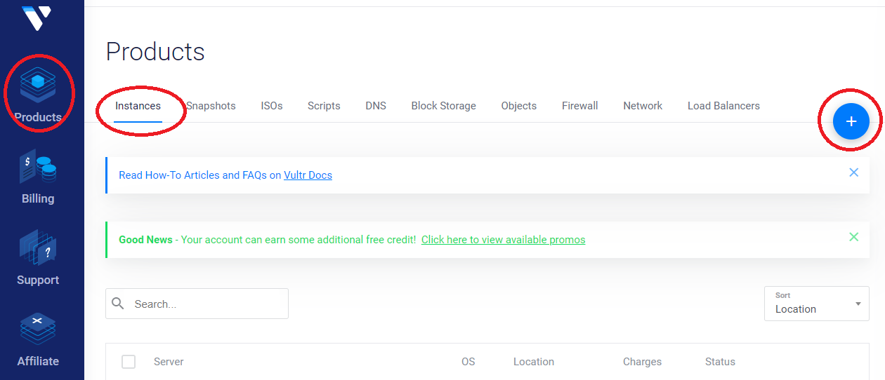

2. We will select the following options:

    - **Choose Server**: _Cloud Compute_
    - **Server Location**: I.e. _Amsterdam_

    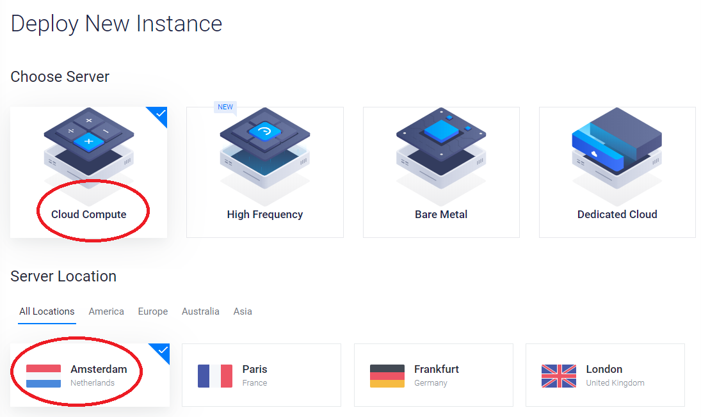

    - **Server Type**: In _64-bit OS_ tab we will choose _Ubuntu 18.04 LTS_ because it is the most compatible with all the types of staking that we are going to use.
    - **Server Size**: _25 GB SSD_ that costs \$5/month with adittional settings _1 CPU, 1024MB Memory y 1000GB Bandwidth_

    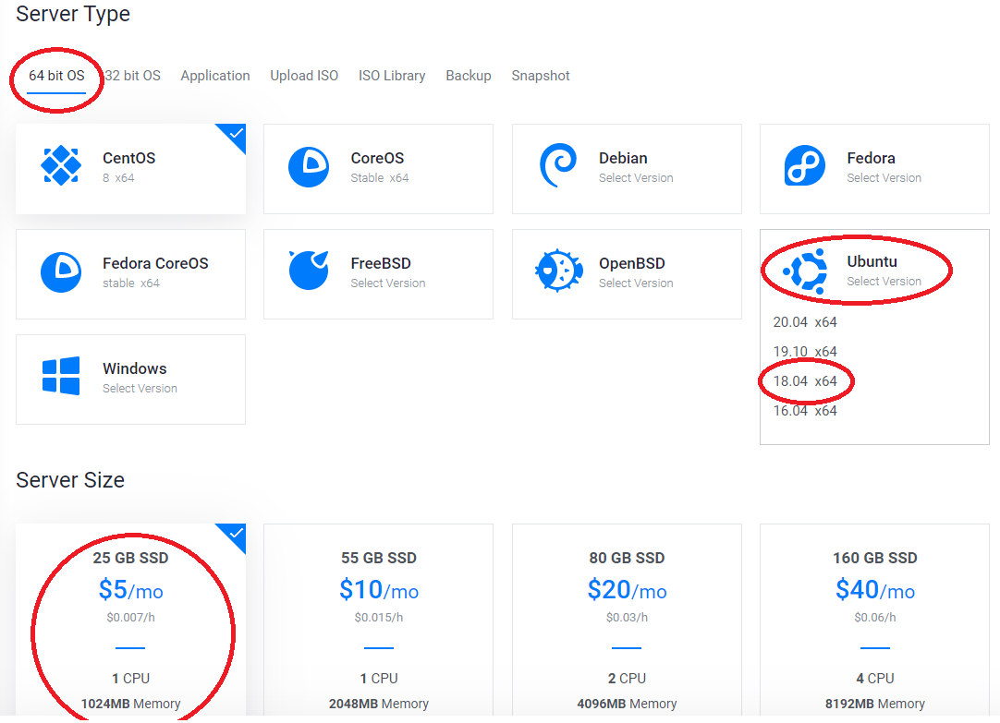

    - **Setting server's name**: I.e. _StakingMUE_
    - **Deploy Now**: We'll push button to deploy VPS server instance.

    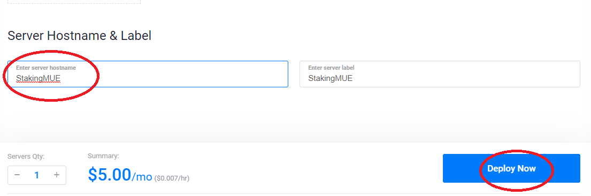

Once these actions are performed, it will return us to the _Products_ screen where we can watch VPS server deployment. Then, when finished deployment, VPW will appear as _Running_. If we click on the three points on the right side we can access the server details.

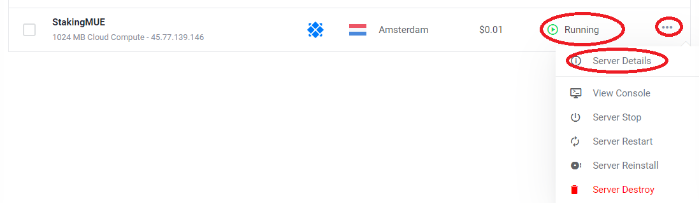

In this section we can see the data that will allow us to connect remotely to server such as its IP address, administrator's username and its password. We can also monitor the used network bandwidth, the CPU usage and the accumulated cost of the service (it's priced per hour, so we can delete it without having to pay for monthly or higher periods, we will only pay what we used for in hours).

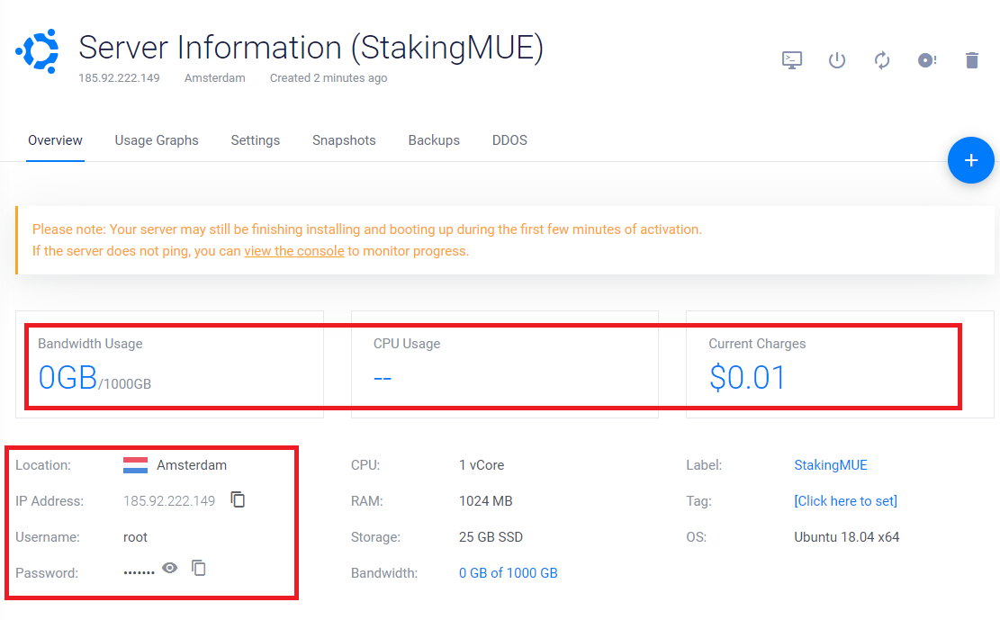

## Server access

Now, we must access server to set it up. We'll use an SSH client that, depending on the S.O. from our home computer, could be:

-   **GNU/Linux and MacOS X**: These systems have _ssh_ client at the operating system terminal. To access VPS already deployed we'll use these command (replacing SERVER_IP with the one provided by [Vultr](https://www.vultr.com/?ref=8598591-6G) on server details screen, \_185.92.222.149\_ on the images):

```
ssh root@SERVER_IP
```

Now the command line will ask us to allow and store server credentials. We'll answer yes (this message will never appear again). Then will be asked to enter the _root_ user password. We'll use the one on server details screen.

-   **Windows**: We can download one of these free clients:

    -   [**Bitvise SSH Client**](https://dl.bitvise.com/BvSshClient-Inst.exe)
    -   [**PuTTy**](https://www.putty.org/)

    Both works by setting _SERVER IP_, _root_ as user and root _password_.

## Basic server configuration

Once we've logged as _root_ into VPS we, first of all, must configure the system using this commands:

-   Updating system to last version:

```
apt update && \
apt upgrade -y
```

-   Setting swap memory:

```
dd if=/dev/zero of=/swapfile bs=4M count=1024 && \
chmod 600 /swapfile && \
mkswap /swapfile && \
swapon /swapfile && \
echo -e '/swapfile none swap defaults 0 0' >> /etc/fstab && \
echo -e 'vm.swappiness=10' >> /etc/sysctl.conf
```

-   Rebooting system so changes take place:

```
reboot
```

-   Loggin again as _root_ we'd install graphic environment to allow remote desktop connections:

```
apt install -y xfce4 firefox firefox-locale-es tigervnc-standalone-server
```

-   Now we're going to create the user whom will run the **MonetaryUnit** software (set the user password when asked):

```
adduser staker
```

-   Setting user rights (so we could run administrator commands):

```
usermod -aG sudo staker
```

-   Now we'd log as _staker_ user to go on:

```
su - staker
```

-   We need to set _VNC_ server for this user (set a _VNC_ password when asked for and we don't need a view only password):

```
vncserver
```

Now we must set _VNC_ default config:

```
vncserver -kill :1 && \
echo -e '#!/bin/bash \nxrdb \$HOME/.Xresources \nstartxfce4 &' > ~/.vnc/xstartup
```

-   To set the system so it will restart _VNC_ service everytime the system must be rebooted we need to exit to _root_ prompt and execute the following commands:

```
exit

echo -e '[Unit] \nDescription=Start VNC server at startup \nAfter=syslog.target network.target \n \n[Service] \nType=forking \nUser=staker \nGroup=staker \nWorkingDirectory=/home/staker \n \nPIDFile=/home/staker/.vnc/%H:%i.pid \nExecStartPre=-/usr/bin/vncserver -kill :%i > /dev/null 2>&1 \nExecStart=/usr/bin/vncserver -depth 24 -geometry 1280x960 :%i \nExecStop=/usr/bin/vncserver -kill :%i \n \n[Install] \nWantedBy=multi-user.target \n' > /etc/systemd/system/vncserver@.service && \
systemctl daemon-reload && \
systemctl enable vncserver@1.service && \
systemctl start vncserver@1 && \
reboot
```

-   Once the system has rebooted we will set the firewall rules to avoid unwanted intrussions (we must answer yes when prompt):

```
ufw allow ssh && \
ufw enable
```

## Setting secure access to _VNC_ remote desktop:

Depending on the operating system we will use to connect to VPS _VNC_ server we must:

-   **GNU/Linux o MacOS X**: Run this command to create a secure tunnel from the client to the server using _ssh_ properties:

```
ssh -L 5901:127.0.0.1:5901 -C -N -l staker SERVER_IP
```

-   **Windows**: Depending on the client we must follow the images below:

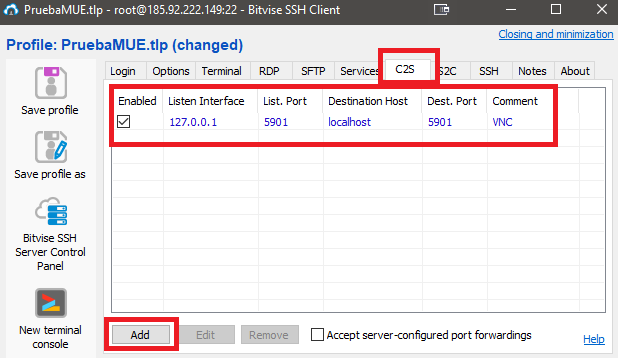

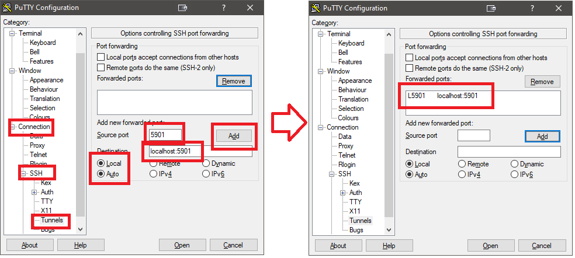

## Setting _VNC_ client:

Almost every _VNC_ client has similar way of setting up. We must define the connection to _localhost_ server (so we'll use the already created secure tunnel) to _5901_ port (follow the images examples):

On **Windows** I'd like to use [RealVNC](https://www.realvnc.com/download/file/viewer.files/VNC-Viewer-6.20.529-Windows.exe) so its config will look like this:

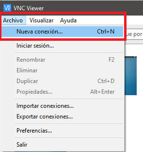

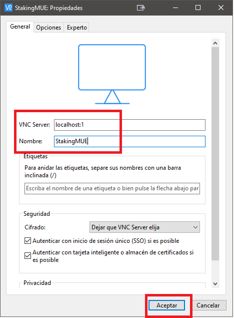

When connecting to _VNC_ VPS service we need to write the _VNC_ password from point **4**.

First time logging to remote desktop we must select default pannel desktop config:

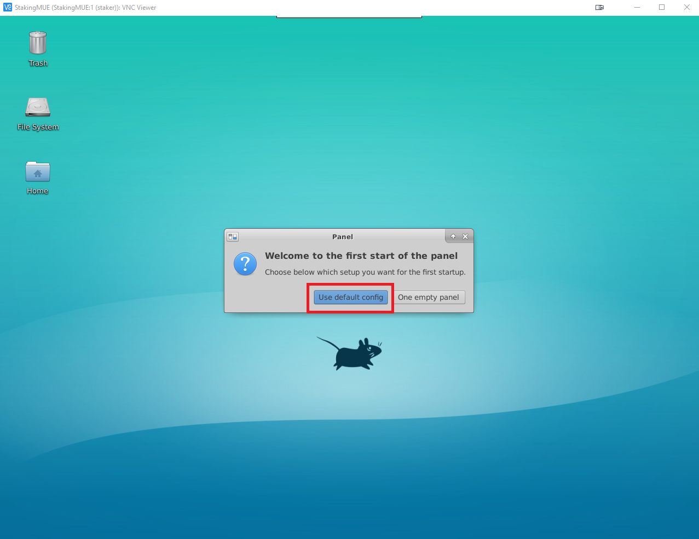

## **MonetaryUnit** installation:

On remote desktop we must open a console and execute this command (v2.1.6 is the last wallet version when writting this manual):

```
wget https://github.com/muecoin/MUE/releases/download/v2.1.6/mon-2.1.6-x86_64-linux-gnu.tar.gz && \
tar xvzf mon-2.1.6-x86_64-linux-gnu.tar.gz && \
mkdir ~/bin && \
echo -e 'PATH=~/bin:$PATH' >> .bashrc && \
mv mon/bin/* ~/bin && \
rm -Rvf mon/ mon-2.1.6-x86_64-linux-gnu.tar.gz
```

Now we can set a desktop launcher so we can run wallet using the mouse:

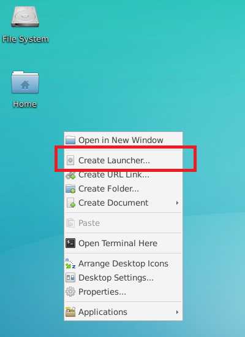

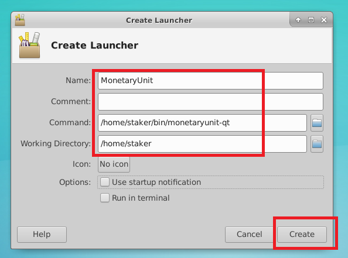

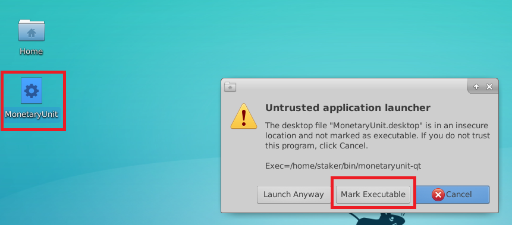

Et VOILÁ!


